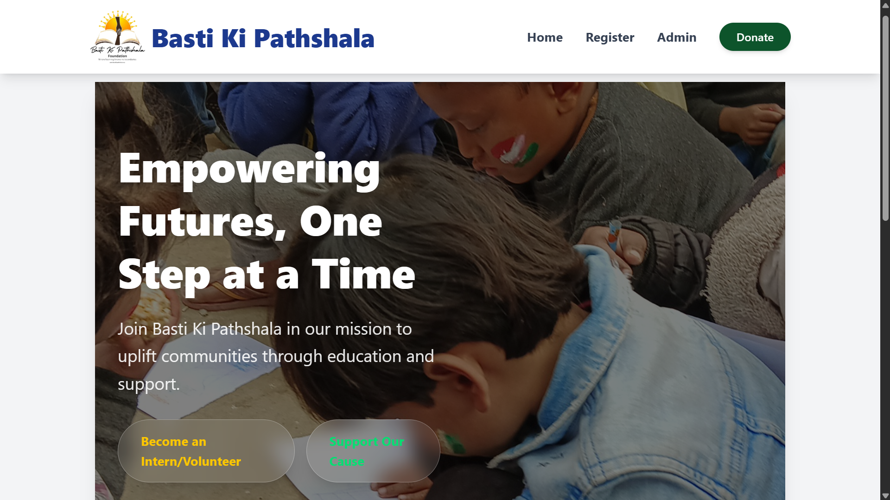
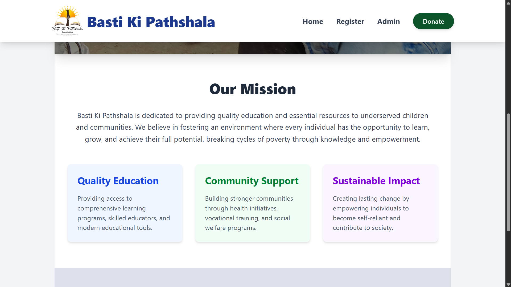
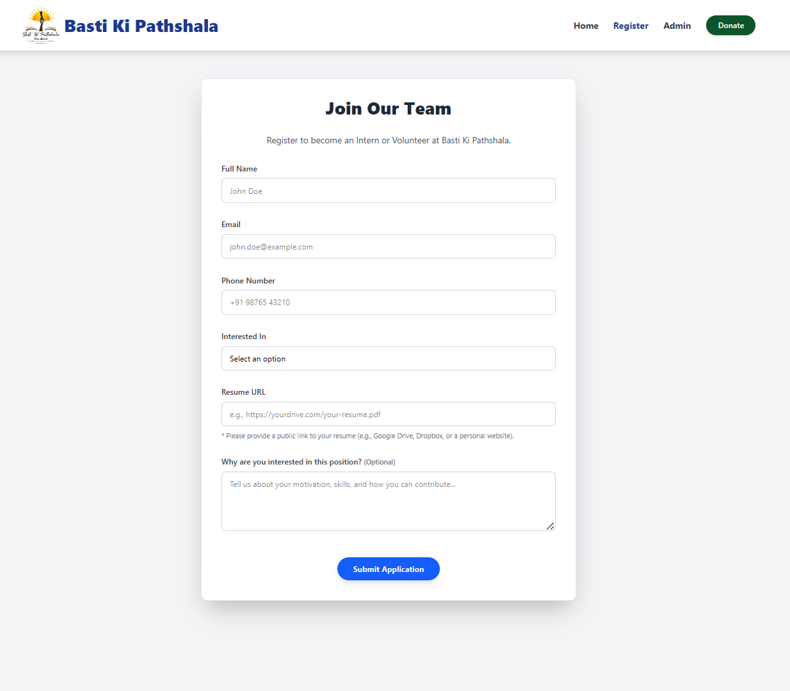
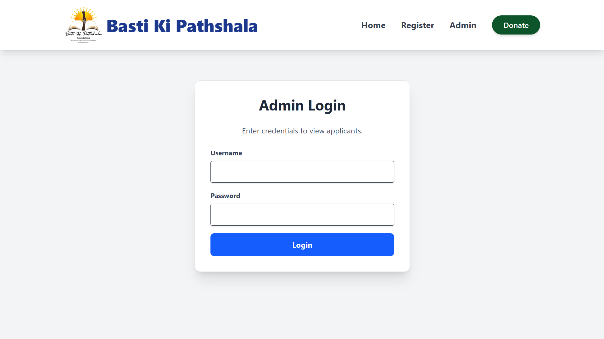
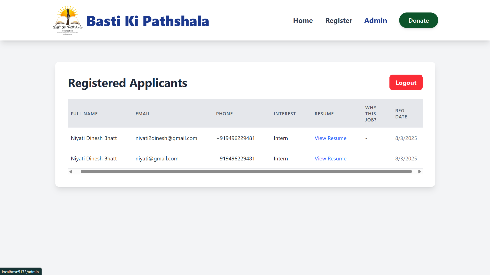

# Intern/Volunteer Registration & Admin Panel (Full Stack)

## Project Overview

This project is a full-stack web application developed as an internship assignment. It provides a platform for individuals to register as interns or volunteers and offers an administrative interface to view and manage applicant data. The application is built using the **MERN stack** (MongoDB, Express.js, React, Node.js) with **Tailwind CSS** for a modern and responsive user interface.









## Features

This application includes the following key functionalities:

* **Home Page:** A welcoming landing page providing an overview of the organization's mission and encouraging engagement.
* **Intern/Volunteer Registration Form:**
    * Allows prospective interns/volunteers to submit their personal details, contact information, interest (intern/volunteer), resume URL, and a motivational message.
    * **Client-Side Validation:** Basic real-time feedback for input fields.
    * **Server-Side Validation:** Robust validation implemented using `express-validator` to ensure data integrity and prevent invalid submissions.
    * **User Feedback:** Utilizes `react-hot-toast` for clear success/error notifications on form submission.
    * **Loading States:** Visual indicators during form submission to enhance user experience.
* **Admin View:**
    * A protected interface for administrators to view a comprehensive list of all registered applicants.
    * **Backend-Protected Authentication:** A basic username/password login system where credentials are verified against a MongoDB database. Passwords are securely hashed using `bcryptjs` before storage and comparison, adhering to essential security practices.
    * Displays applicant details including name, email, phone, interest, a clickable link to their resume, and their motivational message.
    * Features a responsive table layout for easy viewing.
* **Responsive Design:** Implemented using **Tailwind CSS** to ensure a seamless experience across various devices (desktops, tablets, mobile phones).
* **Modular Backend Architecture:** The backend is organized into distinct modules for database connection, Mongoose models, and API routes, promoting maintainability and scalability.

## Technologies Used

### Frontend
* **React.js:** JavaScript library for building dynamic and interactive user interfaces.
* **Vite:** A next-generation frontend tooling that provides a fast development experience.
* **Tailwind CSS:** A utility-first CSS framework for rapidly building custom designs.
* **React Router DOM:** For declarative client-side routing and navigation.
* **React Hot Toast:** For providing elegant and non-intrusive toast notifications.

### Backend
* **Node.js:** JavaScript runtime environment for server-side logic.
* **Express.js:** A minimalist web framework for building robust APIs.
* **MongoDB:** A NoSQL database used for storing application data.
* **Mongoose:** An ODM (Object Data Modeling) library that simplifies MongoDB interactions in Node.js.
* **Express-Validator:** A set of Express.js middlewares for server-side data validation and sanitization.
* **Bcrypt.js:** A library used for hashing and comparing passwords securely.
* **Dotenv:** For loading environment variables from a `.env` file, keeping sensitive data out of the codebase.
* **CORS:** Middleware for enabling Cross-Origin Resource Sharing, allowing frontend and backend to communicate.

## Project Setup and Local Development

Follow these steps to get the project up and running on your local machine for review.

### 1. Clone the Repository
Open your terminal or command prompt and execute the following:
```bash
git clone https://github.com/Niyati-Dinesh/basti-ki-pathshala
cd basti-ki-pathshala
```
### 2. Backend Setup
```bash
cd backend
pnpm i
```
### 3.Frontend Setup
```bash
pnpm i
```
### 4. Create a .env. Populate it with your local database connection string and admin credentials:
```
PORT=5000
MONGO_URI=<mongodb connection url>
ADMIN_USERNAME=<admin username>
ADMIN_PASSWORD_BACKEND=<admin password>
```
### 5. Run both backend and frontend
```bash
npm run both
```

### Contribution
This project was developed as part of an internship assignment for Basti-Ki-PathShala to demonstrate proficiency in full-stack web development using the MERN stack.
